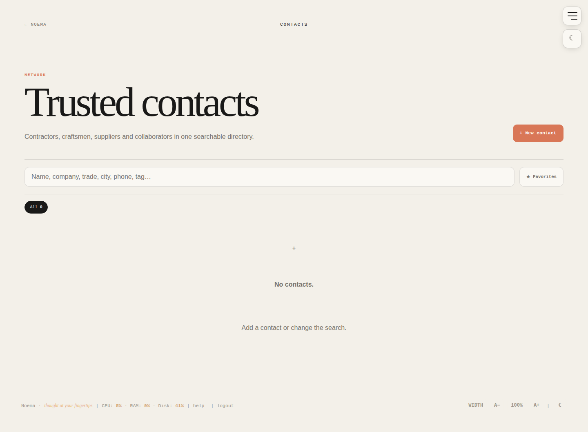

# Noema

Noema is a secure, self-hosted personal workspace built with Node.js, the built-in SQLite module, plain HTML, CSS and JavaScript. It combines tasks, notes, documents, links, encrypted files, contacts, project galleries, calendar integration, analytics, backups, MCP tools and OpenAPI routes in one interface.

> **Stable public reference line: 0.3.x.** The public repository is a complete standalone application and does not depend on any private Noema deployment or repository.

## Screenshots

All screenshots are generated from a clean checkout with neutral demo data. The screenshot workflow refuses to use a repository `data/` directory containing user data.

| Home | Files |
|---|---|
|  |  |

| Notes | Documents |
|---|---|
|  |  |

| Links | Inspiration |
|---|---|
|  |  |

| Contacts | Building Sites |
|---|---|
|  |  |

Additional neutral screenshots are available in [`docs/screenshots/`](docs/screenshots/), including Stats, Backup, AI Projects, Archive, Help, Login and the 404 page.

## Included modules

- Yesterday / today / tomorrow task board with priority, time, subtasks, recurring tasks, archive and drag-and-drop ordering.
- Notes and Documents with source-linked task creation.
- Links with labels, search, card/table views and safe handling of existing encrypted thumbnails.
- Files with folders, encrypted metadata, encrypted streaming uploads, HTTP Range downloads and a 120 MB per-file limit.
- Contacts directory with categories, search, favorites, contact details and references.
- Building Sites and Inspiration galleries with encrypted managed media and scoped share links.
- AI Projects catalog and optional Stats dashboard.
- Google Calendar read-only integration with encrypted refresh-token storage and session-bound OAuth state.
- Encrypted full disaster-recovery backups and portable metadata export.
- MCP and OpenAPI endpoints for machine integrations.

## Security model

Noema follows one persistent-storage rule:

> **Everything the user enters, uploads, or Noema generates from private user data is encrypted at rest.**

A random 256-bit installation data key encrypts application data with AES-256-GCM. `UI_PASSWORD` authenticates the browser UI and protects the wrapped installation key stored in `NOEMA_DATA_DIR/master.key`; the password itself is not the AES data key.

Browser access is protected by opaque revocable server-side sessions. Machine clients use a separate bearer token. The outer security gateway applies trusted-proxy handling, bounded login/API rate limiting, CSP and other production security headers. Private/API/file/gallery/backup responses are forced away from browser caching, while only source-controlled static assets receive short-lived caching.

Noema uses server-side encryption at rest, **not end-to-end encryption**. An authorized running Noema process can decrypt data to serve it.

Read [SECURITY.md](SECURITY.md), [PRIVACY.md](PRIVACY.md) and [ARCHITECTURE.md](ARCHITECTURE.md) before an Internet-facing deployment.

## Requirements

- Node.js **22.16+**, or Docker.
- Persistent storage for `NOEMA_DATA_DIR`.
- HTTPS for Internet-facing production deployments.
- `zip` and `unzip` for full backup/restore outside the supplied container.

No runtime npm dependencies are required by Noema itself.

## Quick local start

```bash
cp .env.example .env
# Set UI_PASSWORD for normal browser authentication.
npm run check
npm start
```

Open `http://localhost:3000`.

For an isolated development-only instance, `ALLOW_INSECURE_NO_AUTH=true` may be used instead of browser authentication. Never use that setting for production.

## Production configuration

At minimum:

```dotenv
NODE_ENV=production
PUBLIC_BASE_URL=https://noema.example.com
NOEMA_CORS_ORIGIN=https://noema.example.com
UI_PASSWORD=replace-with-a-strong-master-password
NOEMA_API_TOKEN=replace-with-a-separate-long-random-token
NOEMA_BACKUP_PASSWORD=replace-with-a-separate-long-backup-password
```

Configure controlled reverse-proxy addresses with `NOEMA_TRUSTED_PROXY_IPS` and prevent direct public access to the backend port. See [DEPLOYMENT.md](DEPLOYMENT.md).

## Docker

```bash
docker build -t noema .
docker run --rm -p 3000:3000 \
  -v noema-data:/app/data \
  --env-file .env \
  noema
```

The standard image uses Node 24 Alpine, runs project checks and a production startup/health smoke test during the build, and removes npm/corepack/yarn from the final runtime image.

## Data and backups

Primary metadata lives in `NOEMA_DATA_DIR/noema.sqlite`. Managed encrypted binary data is stored under directories such as:

```text
files/
uploads/
buildingsites/
inspirations/
link-thumbnails/
```

Large managed media is stored in authenticated chunks so authorized byte ranges can be reconstructed without a persistent plaintext copy.

Create a full encrypted disaster-recovery archive:

```bash
npm run backup -- ./noema-backup.noema
```

Restore while Noema is stopped:

```bash
npm run restore -- ./noema-backup.noema /path/to/restored-data
```

A full `.noema` archive includes SQLite, `master.key`, encrypted binary media and compatibility state, then adds a second encryption layer using `NOEMA_BACKUP_PASSWORD`. Portable export is intended for readable metadata transfer and is not a substitute for a full disaster-recovery archive.

## Main routes

| Route | Purpose |
|---|---|
| `/` | Tasks and calendar |
| `/notes` | Notes |
| `/documents` | Documents |
| `/links` | Visual bookmarks |
| `/files` | Encrypted file library |
| `/contacts` | Contacts directory |
| `/ai-projects` | AI project catalog |
| `/buildingsite` | Project/site galleries |
| `/inspiration` | Reference galleries |
| `/stats` | Optional analytics dashboard |
| `/backup` | Backup/export controls |
| `/archive` | Archived task history |
| `/help` | In-app help |
| `/openapi.json` | OpenAPI description |
| `/mcp` | MCP Streamable HTTP endpoint |
| `/healthz` | Health check |

## Link thumbnails

Existing encrypted thumbnails can be served. Automatic browser-based thumbnail generation is intentionally disabled in the main Noema container until an isolated renderer with strict sandbox and network-egress controls is available.

## Public screenshot workflow

`.github/workflows/screenshots.yml` runs project checks, starts an isolated demo instance, generates neutral data with Playwright, captures `docs/screenshots/*.png`, removes the temporary data and commits only changed screenshot files back to the PR branch.

## Documentation

- [PRODUCT.md](PRODUCT.md) — product scope and behavior
- [ARCHITECTURE.md](ARCHITECTURE.md) — request layers, storage and runtime architecture
- [CUSTOMIZATION.md](CUSTOMIZATION.md) — UI and module customization
- [DEPLOYMENT.md](DEPLOYMENT.md) — Docker, reverse proxies, upgrades and backups
- [SQLITE_MIGRATION.md](SQLITE_MIGRATION.md) — storage format and migration
- [PRIVACY.md](PRIVACY.md) — data flows and privacy boundaries
- [SECURITY.md](SECURITY.md) — security model and reporting
- [CONTRIBUTING.md](CONTRIBUTING.md) — development workflow
- [SUPPORT.md](SUPPORT.md) — troubleshooting
- [CHANGELOG.md](CHANGELOG.md) — release history
- [E2EE_ROADMAP.md](E2EE_ROADMAP.md) — optional future client-side E2EE direction

## Repository scope

This public repository contains only generic Noema functionality. Private deployments may diverge independently; private modules, credentials, internal endpoints and installation-specific configuration are intentionally outside the public codebase.

## License

MIT. See [LICENSE](LICENSE).
