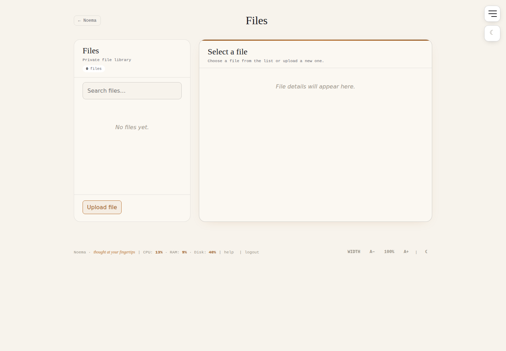

# Noema

Noema is a zero-runtime-dependency, self-hosted personal workspace built with Node.js, the built-in SQLite module, plain HTML, CSS and JavaScript. It brings tasks, notes, documents, links, files, project galleries, calendar events, MCP tools and OpenAPI routes into one private interface.

> **Current public line: 0.3.x** — encrypted-at-rest storage, one-password browser login, revocable server-side sessions, static-only Service Worker caching, encrypted disaster-recovery backups and a hardened Docker deployment.

## Screenshots

All screenshots below are generated automatically from a clean checkout with neutral demo data. The screenshot job refuses to run when `data/` contains user data.

### Home — yesterday / today / tomorrow


### Private Files library



### Notes and documents

| Notes | Documents |
|---|---|
|  |  |

### Links and project galleries

| Links | Inspiration |
|---|---|
|  |  |

More neutral screenshots are kept in [`docs/screenshots/`](docs/screenshots/), including Building Sites, AI Projects, Stats, Backup, Help, Login and the 404 page.

## What Noema includes

- Yesterday / today / tomorrow task board with priority, time, subtasks, archive, drag-and-drop ordering and stable recurring tasks.
- Notes, documents, Links, AI Projects, Building Sites, Inspiration, Stats and a private **Files** library.
- **Private-data encryption at rest:** record payloads and managed private binary content remain encrypted in persistent storage.
- Files metadata is encrypted in SQLite; Files binary content is stored in an authenticated AES-256-GCM container below `NOEMA_DATA_DIR/files` with a 120 MB per-file limit.
- Document uploads, Building Site/Inspiration media and previously generated Links thumbnails are stored encrypted below `NOEMA_DATA_DIR`.
- Source-linked tasks from Notes, Documents, Links, Files, galleries and AI Projects.
- One responsive navigation system, active-page highlighting, light/dark mode, font scaling and persistent WIDTH control.
- Google Calendar read-only integration with encrypted refresh-token storage and session-bound OAuth state.
- MCP and OpenAPI endpoints for authenticated machine clients.
- Opaque, revocable browser sessions with idle/absolute expiration.
- Trusted-proxy handling, production security headers and bounded login/API rate limiting.
- Expiring, revocable and scope-limited gallery-share links.
- Password-encrypted `.noema` disaster-recovery archives protected by a separate backup password.
- Static-only Service Worker caching: private/API/gallery/file/backup responses are network-only and never intentionally persisted in browser Cache Storage.
- Docker build tests, encrypted-storage regression tests, recurrence/DST coverage, security checks and a strict production startup smoke test.

## Security model

Noema follows one persistent-storage rule:

> **Everything the user enters, uploads, or Noema generates from private user data is encrypted at rest.**

A random 256-bit installation data key encrypts application data with AES-256-GCM. `UI_PASSWORD` is the single password entered in the browser: it authenticates the UI and protects the random installation key stored in wrapped form in `NOEMA_DATA_DIR/master.key`. The password itself is not the AES data key.

Browser authentication is owned by `src/security-gateway.js`. Noema does **not** use HTTP Basic Auth and does not send `WWW-Authenticate` challenges. Successful login creates an opaque random session token; only a hash and encrypted session metadata are stored.

This is server-side encryption at rest, **not end-to-end encryption**. An authorized running Noema process can decrypt data to serve it. The model protects persistent/offline storage exposure, not a fully compromised running host.

See [SECURITY.md](SECURITY.md), [PRIVACY.md](PRIVACY.md) and [ARCHITECTURE.md](ARCHITECTURE.md).

## Requirements

- Node.js **22.16+** for direct execution, or Docker.
- Persistent storage for `NOEMA_DATA_DIR`.
- HTTPS for an Internet-facing production deployment.
- `zip` and `unzip` for full backup/restore outside the provided container.

No runtime npm dependencies are required by Noema itself.

### Link thumbnails

Serving existing encrypted thumbnails remains supported. **Automatic browser-based thumbnail generation is intentionally disabled in the main Noema container** because launching a general-purpose browser against user-controlled URLs requires stronger DNS/network isolation than the application process can safely provide. A future isolated renderer can restore generation without weakening the main container.

## Quick local start

```bash
cp .env.example .env
# Set UI_PASSWORD for the normal browser-login path.
# For an isolated local test only, you may instead set:
# ALLOW_INSECURE_NO_AUTH=true
npm run check
npm start
```

Open `http://localhost:3000`.

## Production configuration

Production fails closed unless authentication and HTTPS-related settings are valid. At minimum:

```dotenv
NODE_ENV=production
PUBLIC_BASE_URL=https://noema.example.com
NOEMA_CORS_ORIGIN=https://noema.example.com
UI_PASSWORD=replace-with-a-strong-master-password
NOEMA_API_TOKEN=replace-with-a-long-random-machine-token
NOEMA_BACKUP_PASSWORD=replace-with-a-separate-long-backup-password
```

For a new production installation, `UI_PASSWORD` must be strong and `NOEMA_API_TOKEN` must be a separate long secret. `ALLOW_INSECURE_NO_AUTH=true` is development-only.

Existing installations that still use a legacy `ENCRYPTION_KEY` should keep it only during the controlled migration. Remove it after a successful restart/login/data validation cycle.

See [DEPLOYMENT.md](DEPLOYMENT.md) for reverse-proxy, Docker, upgrade and backup guidance.

## Docker

```bash
docker build -t noema .
docker run --rm -p 3000:3000 \
  -v noema-data:/app/data \
  --env-file .env \
  noema
```

The supplied image uses Node 24 Alpine, runs the complete project checks under isolated test configuration, performs a strict production startup/health smoke test and removes npm/corepack/yarn from the final runtime image.

## Data and backups

Primary metadata lives in `NOEMA_DATA_DIR/noema.sqlite`; private record payloads are encrypted before insertion. Managed binary data lives in encrypted directories such as:

```text
files/
uploads/
buildingsites/
inspirations/
link-thumbnails/
```

Large managed media uses independently authenticated chunks so authorized byte ranges can be reconstructed without storing plaintext copies in a public directory.

Create a full encrypted archive:

```bash
npm run backup -- ./noema-backup.noema
```

Restore while Noema is stopped:

```bash
npm run restore -- ./noema-backup.noema /path/to/restored-data
```

A full `.noema` archive includes the complete persistent data set, including SQLite, `master.key`, encrypted binary media and compatibility state, then adds a second encryption layer using `NOEMA_BACKUP_PASSWORD`.

Portable JSON export is different: it is readable metadata intended for inspection/migration and does not include the complete binary data set.

## Main routes

| Route | Purpose |
|---|---|
| `/` | Task board and calendar |
| `/notes` | Notes |
| `/documents` | Documents and checklists |
| `/links` | Visual bookmarks |
| `/files` | Private file library |
| `/ai-projects` | AI project catalog |
| `/buildingsite` | Project/site galleries |
| `/inspiration` | Reference galleries |
| `/stats` | Optional analytics dashboard |
| `/backup` | Metadata/full-backup controls |
| `/help` | In-app help |
| `/openapi.json` | OpenAPI description |
| `/mcp` | MCP Streamable HTTP endpoint |
| `/healthz` | Unauthenticated health check |

## Public screenshot workflow

`npm run check` validates the application itself. Public repository screenshots are generated separately with Playwright by `.github/workflows/screenshots.yml`.

The screenshot generator:

1. refuses to run if `data/` contains anything;
2. starts a temporary Noema instance with test-only credentials;
3. creates neutral demo Notes/Documents/Links/galleries;
4. captures the public UI at desktop size;
5. tears down the test data directory;
6. commits only `docs/screenshots/*.png` back to the documentation branch.

This keeps README imagery reproducible without exposing a real installation.

## Documentation

- [PRODUCT.md](PRODUCT.md) — product scope and behavior
- [ARCHITECTURE.md](ARCHITECTURE.md) — request layers, storage and runtime architecture
- [CUSTOMIZATION.md](CUSTOMIZATION.md) — UI/module customization
- [DEPLOYMENT.md](DEPLOYMENT.md) — Docker, reverse proxies, upgrades and backups
- [SQLITE_MIGRATION.md](SQLITE_MIGRATION.md) — storage format and migration
- [PRIVACY.md](PRIVACY.md) — data flows and browser/storage privacy
- [SECURITY.md](SECURITY.md) — security model and vulnerability reporting
- [CONTRIBUTING.md](CONTRIBUTING.md) — development workflow
- [SUPPORT.md](SUPPORT.md) — troubleshooting
- [CHANGELOG.md](CHANGELOG.md) — release history
- [E2EE_ROADMAP.md](E2EE_ROADMAP.md) — optional future client-side E2EE direction

## License

MIT. See [LICENSE](LICENSE).
